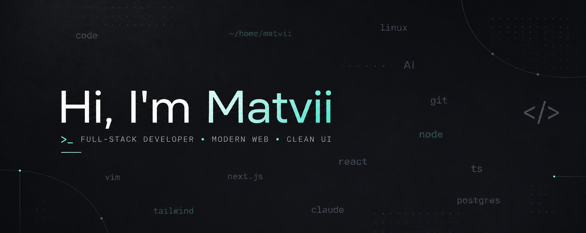

  

  <strong>Full-Stack Developer</strong>

  I build clean, minimal, and thoughtful web experiences with a strong focus on clarity, motion, and feel.

  Front-end is where I feel strongest. Back-end is where I keep pushing deeper.

## Stack

  
  
  
  
  
  
  
  
  
  

## Tools

  
  
  
  
  
  
  
  
  

## Contact

<a href="mailto:bosyimatvii@gmail.com">bosyimatvii@gmail.com</a>

###

<picture>
  <source media="(prefers-color-scheme: dark)" srcset="https://raw.githubusercontent.com/maurodesouza/maurodesouza/pacman-output/pacman-contribution-graph-dark.svg">
  <source media="(prefers-color-scheme: light)" srcset="https://raw.githubusercontent.com/maurodesouza/maurodesouza/pacman-output/pacman-contribution-graph.svg">
  
</picture>

###
